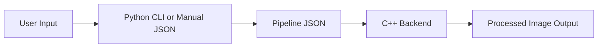

# Sea Vision Project

## Overview
This project provides a flexible, scriptable image processing pipeline. You can build pipelines interactively using a Python CLI, or by writing a JSON config. The C++ backend executes the pipeline, applying each operation in order.

---

## Workflow



---

## How to Use

### 1. Interactive Python CLI

Run:
```sh
python src/python/main_cli.py
```
- Select operations (brightness, blur, contrast, crop, sharpen) by number
- Enter parameters as prompted
- Enter input and output image paths (e.g., `data/input.jpg`, `data/output_result.jpg`)
- The CLI creates a JSON pipeline and runs the C++ backend automatically

### 2. Manual JSON

Create a file like:
```json
{
  "operations": [
    {
      "type": "brightness",
      "parameters": {"factor": 1.2}
    },
    {
      "type": "blur",
      "parameters": {"kernel_size": 5, "sigma": 1.0}
    }
  ],
  "input_image": "data/input.jpg",
  "output_image": "data/output_result.jpg"
}
```
Then run:
```sh
build/Release/sea_vision.exe pipeline.json data/input.jpg data/output_result.jpg
```

---

## Project Structure

```
sea_vision_project/
├── main.cpp
├── CMakeLists.txt
├── src/
│   ├── cpp/
│   │   ├── operations/
│   │   │   ├── cpp/
│   │   │   │   ├── base_operation.cpp
│   │   │   │   └── operations.cpp
│   │   │   └── hpp/
│   │   │       ├── base_operation.hpp
│   │   │       └── operations.hpp
│   │   └── bindings/
│   │       ├── cpp/
│   │       │   ├── operation_factory.cpp
│   │       │   └── pipeline_reader.cpp
│   │       └── hpp/
│   │           ├── operation_factory.hpp
│   │           └── pipeline_reader.hpp
│   └── python/
│       └── main_cli.py
├── data/
│   ├── input.jpg
│   └── output_*.jpg
├── tests/
│   ├── cpp/
│   ├── python/
│   └── json/
│       └── test_pipeline.json
└── build/
    └── Release/
        └── sea_vision.exe
```

---

## Key Files

- **main.cpp**: Entry point, runs the pipeline
- **src/cpp/operations/hpp/operations.hpp / cpp/operations.cpp**: All operation implementations
- **src/cpp/bindings/hpp/operation_factory.hpp / cpp/operation_factory.cpp**: Factory for creating operations
- **src/cpp/bindings/hpp/pipeline_reader.hpp / cpp/pipeline_reader.cpp**: Reads and parses pipeline JSON
- **src/python/main_cli.py**: Interactive CLI for building and running pipelines

---

## Features

- Modular, extensible C++ pipeline
- Interactive Python CLI for easy pipeline creation
- Supports: brightness, blur, contrast, crop, sharpen
- Simple JSON config for reproducible pipelines
- Clean, lowercase output and error messages

---

## Status

- [x] C++ pipeline system with JSON configuration
- [x] 5 core operations
- [x] Factory pattern for dynamic operation creation
- [x] Python CLI for interactive pipeline building
- [x] Clean, lowercase output everywhere
- [x] Refactored and organized codebase
- [x] OpenCV integration with automatic DLL path management